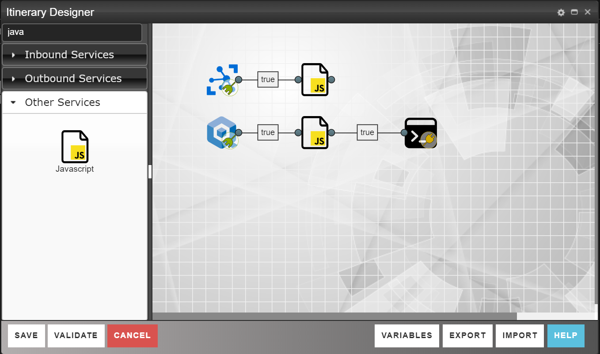
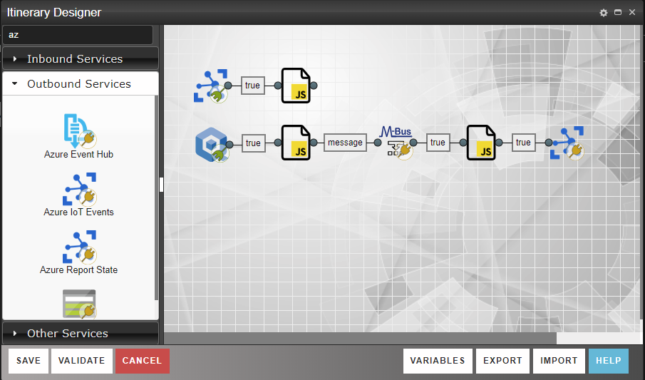

# Read telegrams from sensors and send to cloud

With the whitelist in place, it's time to start reading the Wireless M-Bbus sensors. The gateway is equipped with a Wireless M-Bbus receiver, and all readings captured by the receiver are made available on a serial port. In the case of the enQube gateway this serial port is **/dev/ttyS3**, but will be different depending on what type of device you're using.

To complete this lab, you're going to first read and parse the telegrams from serial port, then match the sensor id of the telegram to the whitelist you created in the previous lab. If the sensor Id is part of the whitelist, you'll send the parsed telegram to your Azure IoT Hub. 

## Read and parse telegrams from serial port

1. To read and distinguish each telegram on the serial port we need a Wireless M-Bbus Service. Open your already created Flow and add an **enQube Wireless MBus Reader** from the Inbound section of the toolbox to your canvas. 
2. Open the **enQube Wireless MBus Reader** Service property window and set the *Node* property to the name of your Node. Give it a *Name* such as "wmbusReader". Click the *Static Properties* tab and make sure the properties are set as below:

| Property | Value |
|-------|--------|
| **Serial port** | /dev/ttyS3 |
| **Baud rate** | 19200 |
| **Data bits** | 8 |
| **Stop bits** | 1 |
| **Parity** | none |

3. Add a **Console Out** Service to the right of the **enQube Wireless MBus Reader** Service and connect the two Services. 
4. Save the Flow, and navigate to the [Nodes page](https://microservicebus.com/Nodes), and toggle On the *Console* for the Node.
5. Open a a new [Console tab](https://microservicebus.com/console) and examine the output. Note that you get messages with the Header information, such as *manufacture, version, type* and *deviceId* are visible, along with the raw telegram.

> *As you continue this lab you're going to use the same **Console Out** Service to examine the output by just adding more Services in between always keeping the **Console Out** Service to the far right of your Flow.*

## Filter telegrams
With telegrams being read, it's time to make use of the whitelist to filter out the ones we care about.

1. Remove the connection between the **enQube Wireless MBus Reader** and the **Console Out** Service, and move the **Console Out** Service to the right.
3. Add a **JavaScript** Service from the toolbox (*Other Services*) and place it between the **enQube Wireless MBus Reader** and the **Console Out**. Give it a *Name* such as "filterWhitelist",  and connect the three Services as the picture below:




4. Right-click the **JavaScript** Service and select *Script*. Add the following code to check if the telegram is part of the whitelist:

```javascript
// Filter the whitelist for the device Id
let existsInWhitelist = whitelist.find( deviceId => deviceId === message.deviceId );

if(!existsInWhitelist){ // Ignore if not
    this.Debug(`Ignoring ${message.deviceId}`)
    message = false;
}
else{ // Pass it through if exists
    this.Debug(`Processing ${message.deviceId}`)
}
```
*If the telegram is not found in the whitelist, the function above will set the message to just 'false'*. 

5. The **JavaScript** Service will either pass the telegram message, or 'false' if not part of the whitelist. We'll use this to only proceed if the message is not false. Double-click the routing expression ("true") between the **JavaScript** Service and the **Console Out** Service. In the editor, update the routing condition as:

```javascript
var route = message;
```

6. Save the Flow, and examine the Console output.

## Parse the raw telegram to JSON

In this step you're going to parse the raw binary array you received in from the Reader to a more readable format.

1. Disconnect the  the **Console Out** Service, and add an **enQube Wireless MBus Parser**. Give it a *Name* such as "wmbusParser".

2. Connect the "filterWhitelist" **JavaScript** Service to the **enQube Wireless MBus Parser** and then the parser to the **Console Out** Service.

3. Set the route of the **enQube Wireless MBus Parser** as you did in step 5 in the previous section, to avoid telegrams that is not part of the whitelist.  

4. Save the Flow, and examine the Console output.

> *[JsonViewer](http://jsonviewer.stack.hu/) is a pretty sweet tool to view resonbly big JSON payload. In the Console output, toggle off the **Format JSON**. Copy the JSON output to [JsonViewer](http://jsonviewer.stack.hu/) and use the treeview to examine the telegram.*

## Map the WMBus payload to a common format 

As you could see in the previous step, the telegram is quite extensive and holds much more data than we care for. In this step you're going to transform the data to a common format using only part of the original telegram. The message has **datablock** section in which all the different readings can be found. However we only care about the first which is the temperature.

1. Remove the **Console Out** Service and replace it with another **JaveScript** Service. Name the Service "transforData". Open up the script editor and paste the code below:

```javascript
// Transforming the message to a more compact format
message = {
    sensorId: message.sensorId,
    temperature: message.telegram.datablocks[0].value,
    unit: message.telegram.datablocks[0].unit,
    ts: this.GetLocalTime()
}

// For Console output
this.Debug(JSON.stringify(message));
```
> *Note the *this.GetLocalTime()* function. This is one of many built-in functions that will return the current datetime based on the Nodes time zone which you can set in the properties of the Node.*

2. Close the editor and save the Flow, and examine the Console output.

## Send WMBus telegram to Azure IoT Hub

You're finally ready to send your readings to the Azure IoT Hub. 
1. Add an **Azure IoT Events** Service after the "transforData" Service, and connect them.

Although it would not be necessary to enable IoT Hub routing for this solution to work, -in reality you're are likely to use the same IoT Hub for a number of different scenarios. It would then be essential to separate the processing of one type of payload from another. In this lab you only have *temperature* readings, but you could imagine there be many others in the future.

For the purpose of enabling IoT Hub routing, you are going to add a *meta data variable* to the message sent to the Azure IoT Hub. There are a few different ways to add meta data, but it's worth knowing that the **Azure IoT Events** will put all content properties and *Variables*, that is not of type *Object*, into the meta data section of the Azure IoT Event sent to the IoT Hub. So the easiest way to add a routing value is to add a *Variable*.

2. Open the *Variables* dialog by clicking the **VARIABLES** button.
3. Add a **String** variable called **"mt"** and set the value to **"tempReadings"**.


**Your finished Flow should look something like this:**


4. Save the flow and proceed to [Create Azure Event Hub and Time Series Insight](./Day_2_Integrate_with_tsi.md)
