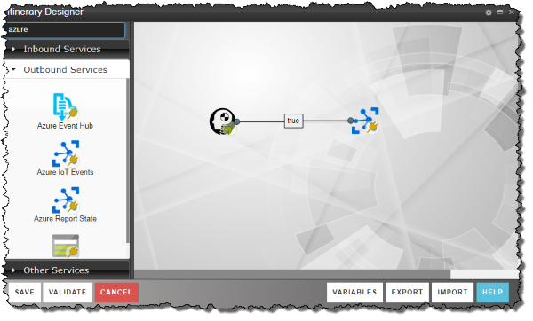
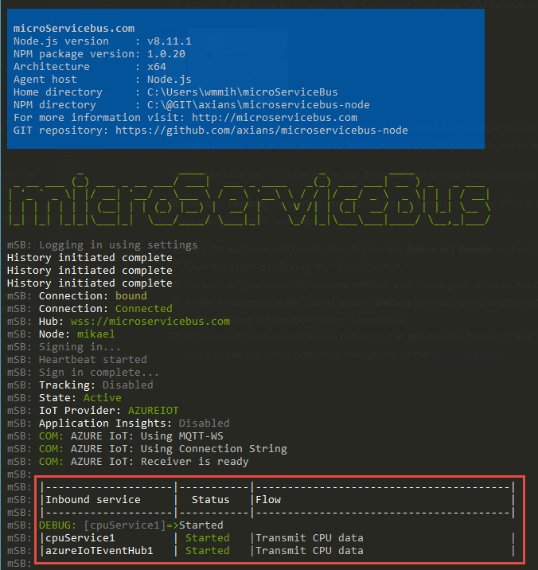

#  microServiceBus.com 

## Getting started
In this first lab you are going to create a solution that submits CPU data from your computer and forward them to the IoT hub and finally to Microsoft Power BI.
The objective is to understand the setup process of the microServiceBus-node and familiarize yourself with **microServiceBus.com** portal. We are not going to complicate things with connectivity to sensors at this stage.

### Installing the Node
In this first lab, you're going to be using your laptop as your device. In later labs we're going to use real devices.

#### Download the device package
But before we begin, we need to install the microservicebus-node package on to your laptop.
1. Open a console or terminal, navigate to a working folder and create a directory called *msb*.
```
mkdir msb
cd msb
```
2. Install the npm package by typing:
```
npm install microservicebus-node
```
This step will now install an NPM package which will serve as our generic device application. **Don't wait for the package to complete, just continue with the step**.

#### Register and start the node
>In the microServiceBus.com portal, a *Node* refers to the agent running on the  device (your laptop in this case). The *Node* is responsible for interacting with the sensors attached to the device and also understands how to communicate with your IoT Hub.

1. Navigate to the *Nodes* page by clicking [this link](https://microservicebus.com/nodes) or using the menu in the upper left corner.
2. Click the **CREATE NEW NODE** button, give it a name such as **"device1"** or click the *GENERATE* button if you feel brave.
>The NPM package from previous step should be installed by now, -and it’s time to start it up. The NPM package you installed is a generic client which hasn’t been given credentials to log in to your organization. There are multiple ways to on-board new devices. In this case we're going to be using a *verification code*. 

3. Now on the Nodes page, click the *“Generate”* button to receive a temporary code.
4. Navigate to the installation directory using the console/terminal window, and type:
```
cd node_modules/microservicebus.node
```
5. Provition your *Node* using the code from step 2 and the name of your *Node*, Eg:
```
node start -c [The code] -n [Node name]
```
The node should startup with no errors:


### Create a micro Service
>Micro services are services that are often generic and independent of other services. They are also, as the name implies, smaller. -They are not as complex as most normal services would be, and they are designed to be more agile. As such they can also be exposed in scenarios where we normally would not see services hosted, such as in devices or circuit, running on a range of platforms. Many ordinary services may qualify as micro services, but a micro service might also be something that turns on your light at home, expose the location of a container or manage configuration of oil rigs.

microServiceBus.com is all about Services, - Services that collects data, Services that sends data or Services that manipulates data. We refer to these services as Inbound, Outbound and other services.
In this first step you’re going to build an Inbound service that picks up CPU utilization. At the end of the lab we’re going to show the numbers in a Power BI report, together with your colleague’s equivalent values.

1. Begin by navigating to the [Scripts & Services page](https://microservicebus.com/files). Click the **CREATE NEW** button, and then select **CREATE NEW**.
2. Give your *Service* a unique name since we're all sharing the same organization. Eg: ```Alex CPU Service``` (prefixing with your name to make it unique). 
3. Give the service a meaningful *Description* and hit **CREATE**.
4. In the *Edit* dialog, open the 0.1 version by clicking **Edit** in the upper right corner.
5. Expand the window by either double-clicking on the window bar at top.
>A service has three functions by default; *Start*, *Stop* and *Process*. The *Process* function is only used for *Outbound* services.

6. As you're building an *Inbound* service you can begin by removing the code in the *Process* function.
7. Next, we're going to add a new function called **cpuAverage**. The purpose of the function is to calculate the CPU utilization. Straight after the *Process* function, before the last curly brackets, paste the following code:

```
    cpuAverage: function () {

        //Initialise sum of idle and time of cores and fetch CPU info
        var totalIdle = 0, totalTick = 0;
        var cpus = os.cpus();

        //Loop through CPU cores
        for (var i = 0, len = cpus.length; i < len; i++) {

            //Select CPU core
            var cpu = cpus[i];

            //Total up the time in the cores tick
            for (type in cpu.times) {
                totalTick += cpu.times[type];
            }

            //Total up the idle time of the core
            totalIdle += cpu.times.idle;
        }

        //Return the average Idle and Tick times
        return { idle: totalIdle / cpus.length, total: totalTick / cpus.length };
    }
```
8. Next, we're going to call the *cpuAverage* from the **Start** function. We want to call the newly created function on an interval, and lucky enough one has already been provided for us. At line 20, Replace the ```// TO DO!``` with:
```
var startMeasure = self.cpuAverage();
```
And delete the rest of the code inside the function. 

9. To make a more accurate measurement, we want to make two readings and calculate the average. Straight after your last line of code, at line 22, add the following.
```
//Set delay for second Measure
setTimeout(function () {

    //Grab second Measure
    var endMeasure = self.cpuAverage();

    //Calculate the difference in idle and total time between the measures
    var idleDifference = endMeasure.idle - startMeasure.idle;
    var totalDifference = endMeasure.total - startMeasure.total;

    //Calculate the average percentage CPU usage
    var percentageCPU = 100 - ~~(100 * idleDifference / totalDifference);

}, 100);
```
10. Great! **percentageCPU** is the value we'd like to submit. But lets add some more attributes the message. At the line after we've declared and set the *percentageCPU* variable, add the following:
```
var computer = os.platform();
var payload = {
    percent: percentageCPU,
    computer: computer,
    node: self.NodeName,
    timeStamp: new Date()
};

// Submit payload to Node.
self.SubmitMessage(payload, "application/json", []);
self.Debug("Submitted reading");
```
You have new created a message and submitting it to the next service.

11. Before you're done, change the frequency on the interval function from 10 seconds to 3 seconds.
```
timerEvent = setInterval(function () {
[...]
}, 3000);
```

[Here](./services/cpuService.js) is complete sample of the service, 


#### Create a Flow
>A *Flow* or scenario is a process defining how *Services* interact. A *Service* is essentially a piece of software (JavaScript in this case) that does something useful, such as reading a sensor, saving a file or transforming a message to the IoT Hub.

1. Begin with navigating to the [Flow page](https://microservicebus.com/Integration),  click the **CREATE NEW** button. Give it a name, such as "Transmit CPU data".

>After the *Flow* has been created, a flow designer will appear. On the left you’ll see *Services* grouped in **Inbound-**, **Outbound-** and **Other Services**. Inbound services are services that starts the flow, for example through reading a sensor. Outbound services are generally sending data somewhere else, as to an IoT Hub or a control unit. Sometimes you need to write some custom script for which you can find the Script service among the Other Services category.

2. Start out by dragging your CPU Service from the toolbox (should be found among the *Inbound Services*) to the designer canvas.
3. Next drag an **Azure IoT Events** service (*Outbound Services*) to the right of the temperature service. 
4. Attach the *Services* by dragging the *Connector* from your CPU Service to the *Azure IoT Events* Service.



>Before you save the *Flow* you need to define where the two *Services* should run. Technically, they could run on different, or multiple *Nodes*, but in this scenario, both *Services* should get deployed to the *Node* running on your laptop.

5. Double-click on *CPU Service in the designer and set the *Node* property to the name of your *Node* Eg. *"device1"*.

>**Static-** and **Security** properties are specific to the *Service* and may differ a lot from one *Service* to the other. We'll look more into *Services* in later labs.

6. Click *Ok* and proceed by double-clicking the **Azure IoT Events** and set the *Node* property to the name of your device.
7. Save the script by clicking the "Save" button.
8. Go back to your console/terminal window and notice your services has been downloaded and started.

9. At the *Node* page in the portal, enable **Debug** by clicking the toggle button for the *Node*. This causes the *Services* to output debug information (every 5 seconds). 
10. Although it's convenient to see the output in the console/terminal, this is a luxury you'll often not have access to. However you can see the same output by navigating to the [Console page](https://microservicebus.com/console).

11. As your readings are getting published to the Azure IoT hub, they should get visible on the main screan.

## Well done, you've completed the first lab.
### [Back to main page](./README.md).
