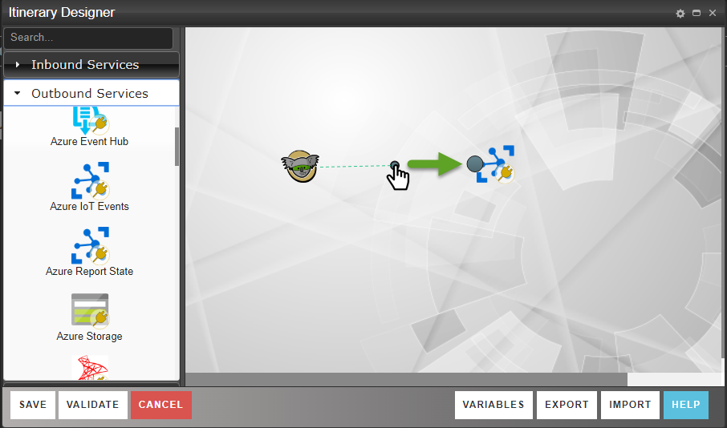

#  microServiceBus.com 

## Getting started
In this lab we’re going to create and end-to-end solution. You are going to create a solution that submits sensor data from the Node and forwards them to Microsoft Power BI.
The objective is to understand the setup process of the microServiceBus-node and familiarize yourself with microServiceBus.com portal. We are not going to complicate things with connectivity to sensors at this stage, so we’re just going to use a simulated temperature sensor.

### Create an Azure IoT Hub
> This step requires you to have access to an Azure Account. Should this not be the case, tell the trainer and he or she will provide a *connection string* for you.
In this step, you’re going to create your own Azure IoT hub which is going to be used for transmitting messages to and from your device.

1.	Log in to the [Azure Portal](https://portal.azure.com/)
2.	Click **New** and type "iot", click the "IoT Hub" option from the drop-down


3.	Give your hub a **Name** and select F1 Free as the Pricing and scale tier. Click **Create** after setting Resource group and Location (North- or West Europe). 

4.	Open the IoT Hub blade if it's not already opend. Click to the **Shared access policies** option in the left-hand menu and click the **iothubowner** policy. Copy the *Connection string—primary key*.
>The connection key is going to be used when settng up your *Organization* in microServiceBus.com in the next step.

### Set up the your Organization in microServiceBus.com

An *Organization* is a where all your devices, or nodes as they are called, are managed. When creating a new Organization, you will automatically be assigned as owner of the Organization. You can later add other people to your organization to share you work.


1. Navigate to [www.microServiceBus.com](https://microservicebus.com) and click the “**Register**” button in the upper right corner. 
2. Fill out your details, accept the terms and conditions and click “**Register**”. 
3. Check your mail box, open the confirmation mail and click the “**Register**” link. 
4. Log in to the microServiceBus.com site using the credentials you supplied in step 2. 
5. Select **"Option 2. Use my Microsoft Azure IoT Hub"**, and provide the **iothubowner** connection string for your Azure IoT Hub. 
6. Uncheck the “*Add sample scenarios*” checkbox and click *Create organization* 

### Installing the Node
In this first lab, you're going to be using your laptop as your device. In later labs we're going to use real devices.

#### Download the device package
But before we begin, we need to install the microservicebus-node package on to your laptop.
1. Open a console or terminal, navigate to a working folder and create a directory called *msb*.
```
mkdir msb
cd msb
```
2. Install the npm package
```
npm install microservicebus.node
```
This step will now install an NPM package which will serve as our generic device application. **Don't wait for the the package to complete, just continue with the step**.

#### Regiter and start the node
>In the microServiceBus.com portal, a *Node* referes to the agent running on the gateway that will run on the device (your laptop in this case). The *Node* is responsible for interacting with the sensors attached to the device and also understands how to communicate with your IoT Hub.

1. Navigate to the *Nodes* page by clinging this [this](https://microservicebus.com/nodes) or using the menu in the upper left corner.
2. Click the **CREATE NEW NODE** button, give it a name such as **"device1"** or click the *GENERATE* button if you feel lucky.
>The NPM papckage should be installed by now, -and it’s time to start it up. The NPM package you installed earlier is a generic client which hasn’t been given credentials to log in to your organization. 
3. Still on the Nodes page, click the *“Generate”* button to receive a temporary code.
4. Navigate to the installation directory using the console/terminal window, type:
```
cd node_modules/microservicebus.node
```
5. Provition your *Node* using the code from step 2 and the name of your *Node*, Eg:
```
node start -c ABC123 -n device1
```
The node should startup with no errors:


#### Create a Flow
>A *Flow* or scenario is a process defining how *Services* interact. A *Service* is essentially a piece of software (JavaScript in this case) that does something useful, such as reading a sensor, saving a file or transforming a message to the IoT Hub.

Begin with navigating to the [Flow page](https://microservicebus.com/Integration),  click the **CREATE NEW** button. Give it a name, such as "Transmit Sensor data".

>After the *Flow* has been created, a flow designer will appear. On the left you’ll see *Services* grouped in **Inbound-**, **Outbound-** and **Other Services**. Inbound services are services that starts the flow, such as reading a sensor. Outbound services are generally sending data somewhere else, as to an IoT Hub or a control unit. Sometimes you need to write some custom script for which you can find the Script service among the Other Services category.

1. Start out by dragging a **Simulator Temperature Sensor** service from the toolbox (Inbound) to the designer canvas.
2. Next drag an **Azure IoT Events** (Outbound) service to the right of the TI Sensor service. Your 



>Before you save the *Flow* you need to define where the *Service* should run. Technically, they could run on different, or multiple *Nodes*, but in this scenario, both *Service* should get deployed to the *Node* running on your laptop.

3. Double-click on **Simulator Temperature Sensor** *Service* in the designer and set the *Node* property to the name of your *Node* Eg *"device1"*.
4. In the *Static Properties* tab, set the interval to **5** seconds.
5. Click *Ok* and proceed by dubble-clicking the **Azure IoT Events** and set the *Node* property to the name of your device.
6. Save the script by clicking the "Save" button.
7. Go back to your console/terminal window and notice your services has been downloaded and started.
8. At the *Node* page in the portal, enable **Debug** by clicking the toggle button. This causes the *Services* to output debug information. 
9. Although it's convinient to se the output in the console/terminal, this is a luxury you'll often not have access to. However you can see the same output by navigating to the [Console page](https://microservicebus.com/console).

