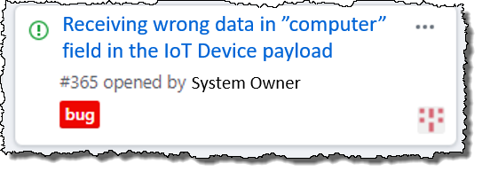

#  microServiceBus.com 

## Manage your devices
>Life is good when everything is up running and performing as expected, -Not so good when it fails, but much worse if you can't solve it remotely...

In the first lab we learned how to build a solution. In this lab we're going to look into managing and trouble-shooting.

### Scenario
The scenario we're going to work with, is that the data you sent upstream in the first lab, is also being sent to a back-end system. The system owner of that back-end system has filed an issue saying they get the wrong information in the **computer** field from your reading. This is critical for their system to work:



We are going to follow a series of steps to identify and resolve this issue: 

### Step 1 - Enable tracking
>No payload-data ever passes microServiceBus.com unless the user enables tracking. Tracking is a tool that provides us with insight into the process and helps us identify the problem.

1. Navigate to the *Nodes* page, and click the **Tracking** toggle-button for your *Node*. Observe in the console/terminal window that is says:  ```mSB: Tracking: enabled```.
2. Navigate to the [Management page](https://microservicebus.com/Instrumentation), and click *Tracking* from the top menu.
3. Expand the "Detailed search" pane by clicking on it. Click the "Add new record" button. Let the *Property* field be "Node" and set the "Value" field to the name of your *Node* and click **Serach**.
4. Click **View details** of second or third records in the list.
>Tracking details are being streamed as they are executed and if you take the first in the list (the last event), it might not be competed, hence you might not get all the details.
5. The *Tracking Details* window shows you all the events that has happened on this instance of the flow. -Click the *View itinerary* button for the **Completed** event.
6. The *Itinerary* window shows you where in the Flow you are, what the message looks like along with variables and properties. - Click on the **Message** tab.

From what we can see, the *computer* field seems to be set to the platform rather than the name of the computer. In this case it's tempting to just go straight to the *Script* page, but we're going to pretend this is a more complex issue.

### Step 1 - Remote debugging
>Remote debugging is a very powerful option which can provide you with valuable insight to your *Service*. You can also run profiling on your *Node* to find potential memory leaks or high memory/CPU contention.

1. Navigate to the *Node* page. Click the **ACTIONS** button and select **Debug**, then click **START DEBUG**.
>The *Node* will now get restarted in "Debug mode". Wait a few seconds and you'll be presented a debug url.
2. Click the **COPY** button, open a new tab (in chrome), and paste the url into the address field. This opens the Chrome Debug Tool.
3. Go to the Sources tab. Expand the top item in left pane ("no domain") to see an overwhelming number of files (sorry about that). Scroll down to your script file. Should be something like: *C:\Users\YOU\microServiceBus\services\alexCpuService.js*
4. Set a breakpoint at approx row 36 (```var computer = os.platform();```) by clicking the row number in the gutter of the editor. Wait a few seconds and the breakpoint should hit.
5. Step over the line by hitting F10, and hover the **computer** variable and view the value.

The problem is that you use ```os.platform()``` rather than ```os.hostname()```. Easy enough to fix. Let's head over to the *Scripts & Services* again. -But first, in *Node* page, make sure to stop debugging by clicking the **STOP DEBUG** button in the debugging window before you proceed. Go back to the Chrome Debug Tool and hit the resume button.

### Fix issue and Restart Node
1. Navigate to the *Scripts & Services* page by hitting CTRL + R to get the command prompt. Type "scripts" and hit Enter. 
2. Open your *Service* and edit the script. Replace ```var computer = os.platform();``` with ```var computer = os.hostname();```.
3. Hit CTRL + R again, and type **restart [YOUR NODE]** Eg.:
```
restart device1
```
4. Switch to the console/terminal window to see the *Node* restarting and make sure it sends the correct data.

## Well done, you've finished lab 2.

### [Back to main page](./README.md).
