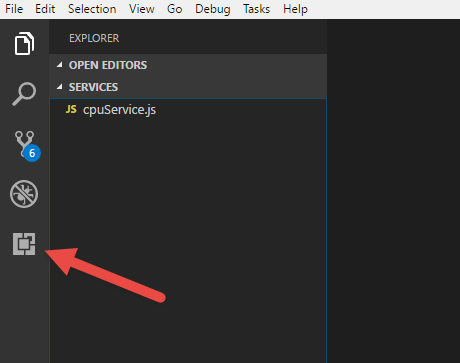
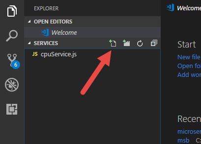
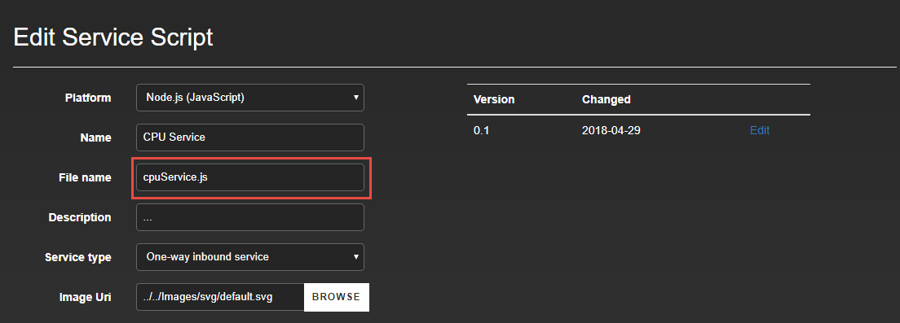

#  microServiceBus.com 

## Application Lifecycle Management
>Managing versions of software running on any number of devices is difficult, especially having multiple environments for testing and production. In this lab, we're going to look into *Application Life Cycle Management*.


### Working with Stage and Production environments
>Most systems today are deployed to multiple environments such as *Dev*, *Stage* and *Prod*, and where we can transition code from one state to the other (and back). In **microServiceBus.com** environments (Stage and Prod) are managed on *Flow* level. 

If this was a real-world solution you'd likely have some *Nodes* is Stage state and many in prod. For arguments sake, let's assume your current *Node* is the Stage node and you'll begin by creating a **Prod** *Node*.

1. Navigate to the *Node* page and click **CREATE NODE** or simply hit CTRL+R and type ```create node```.
2. Give the new *Node* the same name as the first but suffix it with "-prod" Eg.
```
device1-prod
```
3. Hit save and navigate back to the *Nodes* page. Click the **ACTIONS** button of your first *Node* (the stage node), and select **Properties**.
4. In the **Bind to** field, set the name of your production *Node*, and hit *Save*.
5. Navigate to your *Flow* (you know the drill...)
6. In the *Details* window, close the designer and click the "Copy to Prod" link.
7. The page got reloaded and Stage flow got re-opened. Close the designer again and click the "Details" link of the **Production** itinerary.
8. Double-click any *Service* and notice the Node property is set to your production node.
>Production *Flows* are the same as Stage *Flows* except updates are not deployed automatically  when saving the Flow. Instead, this can be done using [Scheduled updates](https://microservicebus.com/ScheduleMaintenance) or by re-staring the node.

### Managing your code in Git
>microServiceBus.com supports both GitHub and Visual Studio Team Services (VSTS). For this tutorial the organization has already been integrated with GitHub.

1. Create a folder on your laptop, and name it "**git**".
2. Open the folder from a console or terminal, and type:
```
git clone https://github.com/axians/microservicebus-tutorial.git
```
3. navigate to the **services** directory by typing:
```
cd microservicebus-tutorial
cd services
```
4. Open Visual Studio by typing:
```
code .
```
5. In Visual Studio Code, click **Extensions** in the left menu:

6. Search for "microservicebus", click the first/only item in the list and then click **Install**.

7. Click the *Create file* button.


8. Give the file the same name as the **file name** of the service you created earlier.
>Normally, this is where you'd start creating your service and this would be where you'd set the name for the first time. However, since we created the *Service* in the portal we need to set the same name in GitHub to correlate the script files.

You can find the file name by navigating to the *Scripts & Services* page and click edit on your service.


9. Back in the *Edit Service Script*, open the script and copy the content. Paste the script into VS Code editor.

>The microSericeBus.com Extension you installed earlier comes with lots of snippets which can make life a bit easier. They are all available by typing "_" (underscore). Let's start with some debug info.

10. After the ```self = this; ``` statement (should be around line 14), type:
```
_debug
```
...and hit Enter, and type "Started".
>The Debug function is similar to ````console.log``` in that it prints the statement to the console, but the statement will also be visible in the portal *Console* provided *Debug* is enabled on the *Node*.

>Services may require input from users, such as connection information, serial ports and more. In our case we'd like the user to be able to set the interval of how often we read the CPU rather than the hard-coded 3 seconds set at the moment.

11. After the debug statement you just created, type:
```
_staticprop
```
...and hit Enter, and type "interval".

>This creates a variable named *interval* that assumes there is a static property called "interval" on the *Service* (there isn't one, but we'll fix that in a minute).

12. Replace the hard-coded value of **3000** at the end of the *setInterval* statement to **interval**.

#### Commit and push to GitHub
Your script is done and we're ready to commit our changes.  

1. Hit CTRL + S to save your script.
2. Click the Git icon in the left menu, type "Modified" in textbox and hit CTRL+S.

3. The script is now committed to your local repo, and we're ready to push it to gitHub. Type:
```
git push
```
4. Navigate back to the portal and notice the notification. Refresh the *File edit* page and notice the new version. Open the script and view your changes.

>Before we're done, lets add the **interval** property to the *Service*. 

5. Click the **Static Properties** tab on the *Edit Service Script* page.
6. Click the **+ Add new record" button. Set the *Property* as following:
* Order : **0** *(indicates in what order the properties are presented for the user)*
* Id : **interval** *(name of the variable)*
* Name : **Interval (ms)** *(property name shown to the user)*
* Description : **Leave empty** *(help text for the user)*
* Initial value : **5000** *(Default value)*
* Type : **integer** *(datatype)*
* Mandatory : **true** *(indicates if it is a required field)*

7. Click Save, and navigate to the *Flow*.

8. Remove the existing *CPU Service* from the designer. -Search and drag the updated service from the toolbox to the *Flow*. Connect the new *Service* to the *Azure Event Service**.
9. Double-click the *CPU Service*, set the *Node* property and click the **Static Property** tab. Notice the new *Interval* property.
10. Click save to publish the updates to the *Node*.   
